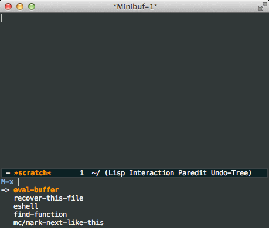

# ido-vertical-mode.el

Makes ido-mode display vertically.

This mode takes care of some caveats that are otherwise ugly to store
in your init file.

You may also be interested in
[`ido-ubiquitous`](https://github.com/DarwinAwardWinner/ido-ubiquitous)
and [`smex`](https://github.com/nonsequitur/smex).

## Install via [MELPA Stable](http://stable.melpa.org/#/) or [marmalade](http://marmalade-repo.org)

`M-x` `package-install` `ido-vertical-mode`

If you use MELPA instead of MELPA Stable, there's no guarantee that
you'll get something that works; I've accidentally broken master
before and will unfortunately probably do it again :(

## Turn it on

    (require 'ido-vertical-mode)
    (ido-mode 1)
    (ido-vertical-mode 1)

Or you can use `M-x ido-vertical-mode` to toggle it.

## Keybindings

Since the prospects are listed vertically, it makes sense to use
`C-n/C-p` to navigate through the options. These are added to the
`ido-completion-map` by default (and `ido-toggle-prefix`, previously
on `C-p`, is moved to `M-p`).

You also have the option to rebind some or all of the arrow keys with
`ido-vertical-define-keys`:

    (setq ido-vertical-define-keys 'C-n-C-p-up-and-down)

to use up and down to navigate the options, or

    (setq ido-vertical-define-keys 'C-n-C-p-up-down-left-right)

to use left and right to move through the history/directories.
